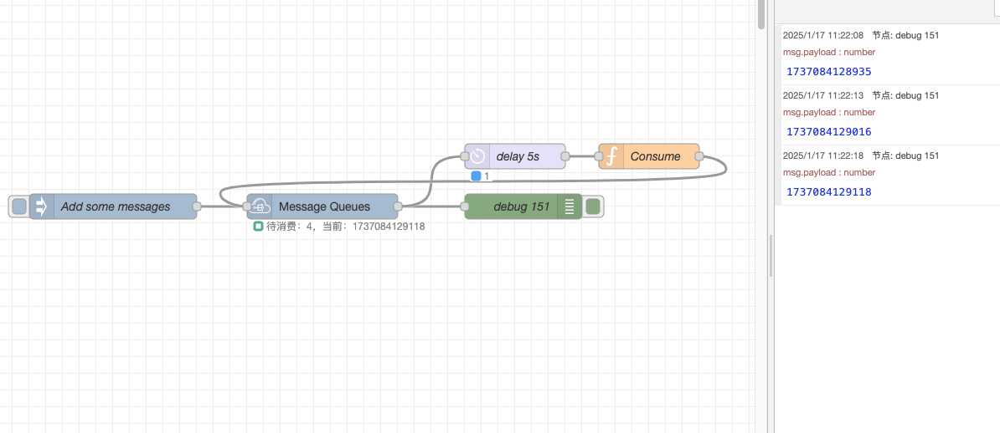

# Node-RED Custom Node: Message Queue

## Overview
This Node-RED custom node provides a message queue. It allows users to add messages to a queue and process them one at a time.

## Features
- **Message Queue Management**: Add and consume messages with a structured queue.
- **Simple API**: Easily interact with the queue using predefined message types.

## Installation

1. Clone the repository or download the source code.
2. Navigate to your Node-RED user directory (usually `~/.node-red`).
3. Run the following command to install the node:

   ```bash
   npm install node-red-contrib-message-queues
   ```
4. Restart Node-RED.

## Usage

### Input Messages
The node processes input messages with the following structure:

- **Add a Message to the Queue:**
  ```json
  {
    "type": "add",
    "payload": "message ID"
  }
  ```
  - `type`: Indicates the operation to perform (`add`).
  - `payload`: The unique ID of the message to add to the queue.

- **Consume the Current Message:**
  ```json
  {
    "type": "consume",
    "payload": "message ID"
  }
  ```
  - `type`: Indicates the operation to perform (`consume`).
  - `payload`: The unique ID of the message currently being processed. Only the active message can be consumed.

### Node Configuration
1. Drag and drop the custom node into your Node-RED flow.
2. Configure any optional settings in the node properties.
3. Connect the node to other nodes for input and output processing.

### Example Workflow
1. **Add Messages:** Send multiple `add` messages to populate the queue.
2. **Process Messages:** Use the `consume` message to process the current message. Upon successful processing, the next message in the queue will be activated.

#### Example Screenshot


### Output
- Outputs the current message being processed.
- Emits errors or status updates in case of invalid operations.
